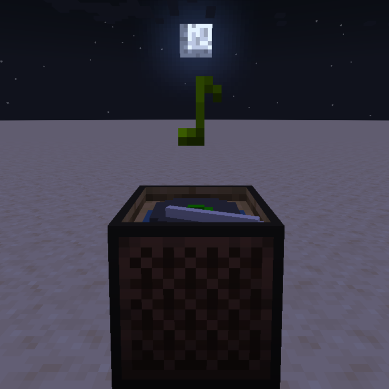

# BetterSound《更好的声音》- Minecraft Forge 模组
<p align="center">
  
</p>

<p align="center">
  <a href="https://github.com/WitcherBB/BetterSound"></a>
  
  
  
  
  
</p>

---

## 📖 目录

- [项目简介](#项目简介)
- [核心功能](#核心功能)
- [快速安装](#快速安装)
- [使用指南](#使用指南)
- [指令速查](#指令速查)
- [技术架构](#技术架构)
- [开发者指南](#开发者指南)
- [版本记录](#版本记录)
- [已知问题](#已知问题)
- [开源协议](#开源协议)
- [致谢](#致谢)

---

## 项目简介

BetterSound 是一款为 Minecraft 1.20.1 开发的 Forge 音效交互增强模组，**由个人独立完成从 0 到 1 的需求设计、代码开发、测试全流程**。

### 解决的核心痛点

1. 原版乐器功能单一：只有音符盒点击，没有完整的钢琴演奏、延音、乐谱播放等专业音乐交互能力；
2. 原版唱片机只能单机近距离手动操作：无法集中控制多台唱片机，难以融入红石自动化场景。

### 核心价值

为玩家提供高沉浸感的游戏内音乐创作体验，同时优化红石音乐场景的操作效率，兼顾娱乐性与实用性。

---

## 核心功能

### 🎹 88 键全音域钢琴系统

- **完整 88 键（A0–C8）**：钢琴为多部件方块（键盘左/中/右 + 踏板共 6 个部件），配套**琴凳**（可坐下演奏）与**独立延音踏板方块**；内置 176 个 OGG 钢琴采样（88 键 × 普通/延音两种音色，音源为 mda Piano）。
- **双操作模式**：鼠标点击/拖拽琴键实时弹奏；支持**自定义键盘按键绑定**（独立按键绑定界面，配置持久化到 options 文件）。
- **延音系统**：钢琴自带踏板部件（右键切换延音状态）+ 独立延音踏板方块，还原真实钢琴的延音逻辑。
- **空间音频**：世界演奏时按音调横向偏移声像（音调越高越靠右）+ 距离衰减；**UI 界面演奏为“设备左右声道”模式**——声像只由音调决定，不依赖世界坐标与距离，音量恒定。
- **音符粒子特效**：弹奏时在对应琴键位置生成音符粒子，随声音消失。
- UI 支持滚轮滑动快速切换音区。

### 🎼 NBS 乐谱播放系统

- 原生支持社区主流 `.nbs` 乐谱格式（新旧两代格式自动识别），**自动跳过鼓等非钢琴轨道**；
- 乐谱文件放在 `<游戏目录>/nbs_bettersound/` 文件夹内，通过 **`/playnbs` 指令**驱动播放（播放 / 暂停 / 继续 / 停止 / 重载）；
- 架构：客户端解析乐谱 → 上传音轨数据给服务端 → 服务端按刻调度 → 广播给所有在线玩家，多人共享同一演奏；
- 演奏时钢琴会按音调在键盘位置发声，并触发音符粒子。

> 待办：在钢琴 UI 内直接导入/搜索乐谱文件（代码中已有 TODO）。

### 🎛️ 唱片机远程集中控制系统

- **唱片机控制器方块**：可命名分组，一个控制器集中管理多台唱片机（绑定关系持久化到存档数据文件，Codec 序列化）；
- **红石联动**：控制器接收红石信号切换开合状态，可无缝接入红石电路与自动化建筑；
- **集中管理界面**：右键点击控制器方块打开，批量开关唱片机、管理绑定；
- 通过 **Mixins 非侵入式扩展**原版唱片机（`JukeboxBlock` / `JukeboxBlockEntity` / `RecordItem`），保留原版全部行为；
- 内置 **9 张自制唱片**（含配套 OGG 音乐）。

### 🏘️ 世界生成

- 平原村庄会生成新的「**音乐小屋**」建筑；
- 独立「**音乐屋**」结构（含 5 种颜色鹦鹉装饰），室内战利品箱可开出音乐相关材料。

### 🧰 其他内容

- **调音器**（Tuner）：工具物品，创造模式下不会破坏音符盒，便于调试；
- **材料与合成**：白键、黑键、键盘、钢琴音芯、钢琴、唱片机控制器均有对应合成配方；
- GUI 内置两款自定义字体（Bahns-chrift 与方正剪纸），中英文双语支持。

---

## 快速安装

### 环境要求

| 依赖项 | 版本要求 |
|--------|----------|
| Minecraft Java 版 | 1.20.1 |
| Minecraft Forge | 47.x（推荐 47.3.5） |
| Java | 17 及以上 |

### 安装步骤

1. 安装对应版本的 Minecraft Forge 加载器；
2. 前往本仓库 [Releases](https://github.com/WitcherBB/BetterSound/releases) 下载最新 `.jar` 文件；
3. 将 `.jar` 放入游戏目录下的 `mods` 文件夹；
4. 启动游戏，在模组列表中确认 BetterSound 已加载。

---

## 使用指南

### 钢琴

1. **获取**：创造模式物品栏「**更好的声音**」分类中获取钢琴、琴凳、踏板；
2. **摆放**：放置钢琴（6 个部件自动组成），配套放置琴凳与延音踏板；
3. **弹奏**：
   - 右键钢琴打开演奏界面；鼠标点击/拖拽琴键即可弹奏，滚轮滑动切换音区；
   - 演奏界面内点击「按键绑定」可自定义键盘快捷键，之后不打开界面也能用按键弹奏；
   - 踩下独立延音踏板或右键钢琴自带踏板部件，获得延音效果。

### NBS 乐谱播放

1. 将 `.nbs` 乐谱文件放入 `<游戏目录>/nbs_bettersound/`（单人开发环境为 `run/nbs_bettersound/`）；
2. 在游戏内对准钢琴所在坐标使用指令，见[指令速查](#指令速查)；
3. 修改乐谱文件后可用 `reload` 指令重载，无需重启游戏。

### 唱片机控制器

1. **获取**：创造模式「更好的声音」分类中获取「唱片机控制器」；
2. **使用**：放置控制器方块，右键打开集中管理界面，按名称分组绑定/管理周围的唱片机；
3. **红石联动**：对控制器输入红石信号即可切换其开合状态，配合现有红石电路使用。

---

## 指令速查

权限等级：1（管理员）。`<坐标>` 指向钢琴任意部件即可（自动定位到钢琴中声部）。

| 指令 | 作用 |
|------|------|
| `/playnbs <坐标> play <文件名.nbs>` | 开始播放指定乐谱 |
| `/playnbs <坐标> play` | 继续播放（resume） |
| `/playnbs <坐标> pause` | 暂停播放 |
| `/playnbs <坐标> stop` | 停止播放 |
| `/playnbs reload` | 重新加载 `nbs_bettersound` 目录下的乐谱列表 |

---

## 技术架构

### 核心技术栈

`Java 17` | `Minecraft Forge 47.3.5` | `ForgeGradle 6` | `Mixins 0.8.5` | `Parchment 映射` | `Maven 发布`

### 模块划分

| 模块 | 职责 | 核心技术 |
|------|------|----------|
| 钢琴模块 `blocks/` `music/` | 钢琴多部件方块与方块实体、88 键音域映射、延音、NBS/MIDI 解析与自动演奏 | OOP 多态（`AbstractPianoBlockEntity`）、NBS 二进制解析器、服务端刻调度 |
| 音频模块 `client/sound/` `client/resources/sounds/` | 钢琴发声实例管理、空间音频、UI 声道分离 | 自研 `PianoSoundInstance`（相机锁定虚拟音源）、`PianoSoundMap` 音符实例管理 |
| UI 模块 `client/gui/` | 钢琴演奏界面、按键绑定界面、唱片机控制界面 | Forge GUI 框架、键鼠事件分发 |
| 网络模块 `network/` | 客户端/服务端数据包（约 15 个） | Forge SimpleChannel「bettersound:messages」 |
| 唱片机模块 `mixins/` `common/data/` | 原版唱片机扩展、绑定数据持久化 | Mixins 字节码注入、DataFixer 风格 Codec 序列化、存档数据文件 |
| 世界生成 `world/` | 音乐小屋结构与村庄建筑注入 | StructureTemplatePool 注入、NBT 结构 |

### 关键设计

1. **原版唱片机兼容性**：通过 Mixins 对 `JukeboxBlock` / `JukeboxBlockEntity` / `RecordItem` 做非侵入式扩展，保留原版全量接口与行为。
2. **NBS 播放的多人同步**：客户端解析 `.nbs` 后把音轨数据（音符映射/速度/拍号）上传服务端，服务端每刻查询该刻音符并广播 `CPianoBlockPlayMultipleNotesPacket`，所有玩家同步听到同一演奏。
3. **空间音频与性能平衡**：世界内演奏按玩家与钢琴的相对方位、音调计算声像与衰减；UI 演奏使用相机锁定虚拟音源（`Attenuation.NONE`），音量恒定、声道只由音调决定，与玩家位置/朝向无关。
4. **NBS 格式兼容**：自研解析器同时支持新旧两代 `.nbs` 格式，自动识别版本、容错处理异常数据、跳过非钢琴轨道。

### 目录结构

```
src/main/java/com/witcherbb/bettersound/
├── blocks/            钢琴/琴凳/踏板/音块/唱片机控制器方块与方块实体
├── client/            GUI 界面、粒子、渲染、声音管理与 UI 声道实现
├── common/            声音事件注册、数据持久化（唱片机绑定）
├── commands/          /playnbs 指令注册
├── data/              数据生成（方块状态/物品模型/标签）
├── event/             Forge 事件总线处理
├── items/             物品与 9 张唱片注册
├── menu/              容器菜单（钢琴/唱片机/音块）
├── mixins/            15 个 Mixin（含自定义 MixinPlugin）
├── music/             NBS 解析器、NBS/MIDI 播放器、乐谱数据模型
├── network/           数据包定义与收发
├── particletype/      粒子类型
├── world/             音乐屋结构与村庄注入
src/main/resources/
├── assets/bettersound/ 贴图、模型、176 个钢琴采样、9 首音乐、字体、语言
└── data/bettersound/   结构 NBT、战利品、配方、世界生成 JSON
```

---

## 开发者指南

### 本地环境搭建

1. 克隆仓库并导入 IntelliJ IDEA（Gradle 项目）：
   ```bash
   git clone https://github.com/WitcherBB/BetterSound.git
   cd BetterSound
   ```
2. 环境要求：JDK 17、Gradle 8.x（自带 wrapper）；
3. 让 IDEA 同步 Gradle 项目后即可运行。

### 常用 Gradle 任务

| 任务 | 说明 |
|------|------|
| `./gradlew runClient` | 启动开发客户端 |
| `./gradlew runData` | 运行数据生成器（输出到 `src/generated/resources/`） |
| `./gradlew build` | 构建并重混淆出模组 jar |
| `./gradlew cleanCache` | 清理 `build/tmp/.cache/expanded`（修改 Mixin 后映射异常时可试） |
| `./gradlew publish` | 发布 jar 到本地 Maven 仓库（`mcmodsrepo/`，由 `build.gradle` 的 publishing 块配置） |

### 版本配置

关键版本集中在 `gradle.properties`：Minecraft `1.20.1`、Forge `47.3.5`、Parchment `2023.09.03-1.20.1`、modid `bettersound`。

---

## 版本记录

| 版本 | 状态 | 说明 |
|------|------|------|
| `1.20.1-0.0.0.0-demo` | Demo | 首个演示版本：钢琴/延音/琴凳、NBS 指令播放、唱片机控制器、音乐小屋结构、9 张唱片 |

---

## 已知问题

- 从唱片机槽位取出唱片时，可能出现一个“假物品”（会自动消失，不影响正常使用）——见 `bugs.md`。
- 模组仍处于 Demo 阶段，部分功能（如钢琴 UI 内导入乐谱）尚未完成。

---

## 开源协议

> ⚠️ 待确认：构建配置（`gradle.properties` / `mods.toml`）声明的模组许可证为 **MIT**，但仓库根目录的 `LICENSE.txt` 是 Forge 的 **LGPL-2.1** 许可原文（ForgeGradle MDK 模板遗留）。正式发布前请确认实际采用的许可证，并替换 `LICENSE.txt` 与徽章。

---

## 致谢

- **音源**：钢琴采样使用免费音源 **Piano by mda**；
- **生态**：Minecraft Forge（及 FML/MCP 团队）、Mojang；
- **格式**：`.nbs` 乐谱格式来自 Open Note Block Studio 社区。
